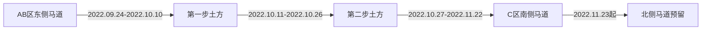

# 第二章 施工组织管理：编写要求与说明

> **本章节是施工总承包管理的“中枢神经系统”，是统筹全专业、全过程、全要素资源配置与动态协同的核心纲领性文件。其质量直接决定项目能否实现“工期可控、界面清晰、穿插有序、风险受控、品质达标”的总体目标。**

---

## 1. 章节目的与作用

| 维度 | 具体说明 |
|--------|----------|
| **战略定位** | 是落实《第一章 总体概述》中项目管理目标（工期、质量、安全、创优）的**顶层执行蓝图**，将宏观目标转化为可操作、可考核、可追溯的组织行为逻辑。 |
| **核心功能** | **① 界面划分器**：明确A/B/C三区及各阶段的责任边界；<br>**② 资源调度图**：定义人、机、料、法、环在时空维度上的配置逻辑；<br>**③ 风险预控阀**：针对基坑、钢结构、医疗专项等重难点，前置组织应对策略；<br>**④ 协同指挥链**：构建总包-分包、土建-机电-装饰、总包-业主/监理的多维沟通机制。 |
| **管理价值** | 避免“多头指挥、交叉打架、资源冲突、责任推诿”；保障**60+专业分包**（幕墙、净化、医用气体、气动物流等）在复杂场地（冯村沟分割、科研基地毗邻、红线内狭小）中高效嵌入、无缝衔接；支撑“鲁班奖”和“绿建二星”目标的组织基础。 |

---

## 2. 应包含的具体内容要点（严格对应文档结构并深化）

> ✅ **必须覆盖文档目录中2.1–2.9全部子项，并基于全文档信息进行实质性扩充与逻辑重构，严禁简单复制粘贴。**

| 序号 | 子章节 | 必须涵盖的核心内容要点（深度要求） |
|--------|---------|-----------------------------------|
| **2.1** | 项目管理目标 | • 将表2.1-1中的**量化指标**（如“鲁班奖”“绿色安全样板工地”“扬尘六个100%”）转化为**组织层面的管控动作**（例：“争创鲁班奖”需明确“创优小组”组织、样板引路流程、细部做法标准库建设）；<br>• 补充**目标分解路径**：如何通过施工组织设计（如跳仓法应用、BIM协同）支撑“结构长城杯”；如何通过分区管理、交通组织保障“绿色安全样板工地”。 |
| **2.2** | 项目组织机构 | • **图2.2-1需升级为“动态组织架构图”**：标注各岗位在**基坑/主体/装饰/竣工**四阶段的职责权重变化（例：基坑阶段“降水工程师”为关键岗，装饰阶段“精装协调经理”权重提升）；<br>• 明确**接口管理机制**：总包与38个气动物流站点、21台电梯、5间MRI屏蔽室等特殊分包的**专属对接通道**（如“医疗专项协调部”直管）；<br>• 强调**数字化赋能**：BIM经理、智慧工地专员作为常设岗位嵌入组织架构。 |
| **2.3** | 总体施工组织安排 | • **深化“三分区”逻辑**：<br> - A/B区以“沉降后浇带”为界 → 解释该划分对**变形监测数据独立性**和**防水施工闭合性**的意义；<br> - C区独立 → 论证其作为“数字医学中心”的**洁净施工独立性要求**（避免AB区交叉污染）；<br>• 新增**组织弹性原则**：当某区进度滞后时，如何通过塔吊、施工电梯等资源共享机制进行补救（如C区塔吊暂借B区使用）。 |
| **2.4** | 基坑施工阶段组织 | • **支护组织**：<br> - 补充“桩锚/悬臂/复合土钉墙”三种体系的**工序耦合逻辑**（如：悬臂桩施工后立即插入冠梁，为后续锚索提供反力平台）；<br> - 明确**降水井与支护桩的时空咬合**：应急减压井何时启用？疏干井如何随开挖深度动态封堵？<br>• **土方组织**：<br> - 绘制**出土马道动态转换图**：AB区东侧马道→C区南侧马道→后期北侧马道的切换节点及交通疏导方案；<br> - 分析**冯村沟栈桥承载力**对重型机械（QUY50A履带吊）通行的影响及加固措施。 |
| **2.5** | 结构施工阶段组织 | • **地下结构**：<br> - 解释“跳仓法”与“后浇带分段”的**双轨并行逻辑**（跳仓法解决底板收缩裂缝，后浇带解决沉降差异）；<br> - 明确**南北雨水调蓄池的预留策略**：为何C4区暂缓？其与“地下室快速回填创造钢结构作业面”的关联性；<br>• **地上结构**：<br> - 构建**“钢结构吊装-混凝土浇筑-机电预埋”三维穿插模型**：例：GKL7箱型梁吊装后，24小时内完成柱内混凝土浇筑及梁端套筒预埋；<br> - 说明**3台塔吊（STT253/403/293）的防碰撞算法**及信号员协同制度。 |
| **2.6** | 装饰装修与机电阶段组织 | • **室内装修**：<br> - 制定**“医疗净化区先行、公共区同步、病房区收口”三级流水线**；<br> - 明确**“机电管线综合排布权”归属**：由总包BIM中心统一出图，各分包签字确认后方可施工；<br>• **外装饰**：<br> - 规划**吊篮安装与屋面防水保护层施工的工序锁死点**（防水未验收，吊篮不得上屋面）；<br> - 设计**陶板/铝板/幕墙龙骨的“工厂预拼装+现场模块化吊装”流程**，减少高空焊接。 |
| **2.7** | 总体施工流程 | • 将图2.7-1升级为**“主控路径甘特图”**：<br> - 标注**关键线路（CPM）**：如“基坑支护→底板浇筑→首层钢柱吊装→幕墙龙骨安装→陶板挂装”；<br> - 标识**浮动时间（Float Time）**：如“污水处理站施工”有15天浮动时间，但不可影响“地下室回填”；<br>• 新增**医疗专项插入点**：CT/DR防护门框安装必须在“墙体砌筑完成、抹灰前”完成，否则影响铅板封边。 |
| **2.8** | 各阶段施工形象进度及管理重点 | • **按阶段匹配文档中所有重难点**：<br> - 基坑阶段：强化“地下水位动态监测频次”（雨季加密至2次/日）、“止水帷幕渗漏应急响应流程”；<br> - 主体阶段：细化“劲性柱节点焊接环境温湿度控制”（冬施需搭设暖棚）、“超限梁模架拆除令签发权限”（必须经总工+安监+BIM三方会签）；<br> - 装饰阶段：增加“医疗设备进场通道净空保障”（如DSA设备运输路线全程无障碍、承重验算）。 |
| **2.9** | 新技术应用计划 | • **从“清单罗列”升级为“实施路线图”**：<br> - 每项技术（如BIM管线综合、钢结构虚拟预拼装）需明确：**应用阶段、责任岗位、输入数据源、输出成果、验收标准、与传统工艺对比效益**（例：BIM综合排布减少返工32%，节约工期18天）；<br> - 关联**智慧工地系统**：如“深基坑监测数据自动接入智慧平台，超警戒值自动推送至项目经理手机”。 |

---

## 3. 编写风格与注意事项

| 类别 | 具体要求 | 反面示例（✘） | 正面示例（✓） |
|--------|----------|----------------|----------------|
| **语言风格** | • **指令性、可执行**：多用“应”“须”“必须”“严禁”等强制性措辞；<br>• **数据驱动**：所有组织安排必须有数据支撑（如“投入3支幕墙队伍”需注明“满足6500㎡/月施工强度”）；<br>• **逻辑严密**：体现“因→果→果效”链条（例：“因冯村沟分割场地→故设置2座栈桥→确保3台塔吊吊运半径全覆盖”）。 | “建议考虑分区管理”<br>“大概需要几支队伍” | “必须按A/B/C三区划分施工界面，其中C区因承担数字医学中心功能，须配置独立洁净施工通道及空气监测系统。” |  
| **图表规范** | • 所有图表（流程图、平面图、甘特图）**编号连续、标题完整、图例清晰**；<br>• **动态图表需标注版本号与生效日期**（例：“图2.4-3 出土马道转换图 V2.0_20220915”）；<br>• 图中关键参数**加粗/色标突出**（如塔吊型号STT403、吊重4.38t）。 | 无编号的手绘草图<br>“见下图”未指明图号 | 图2.5-2 地上结构阶段塔吊覆盖分析图（单位：m）<br>■ STT403覆盖半径：74m（B区100%覆盖）<br>■ 冲突区域：B楼东北角（需汽车吊辅助） |  
| **风险意识** | • 每项组织安排必须附带**对应风险预案**：<br> - “若C区塔吊故障”→ 启用备用汽车吊+调整A区STT253作业半径；<br> - “若医疗气体分包延迟”→ 总包提前预留管道支架，采用临时封堵法兰。 | “按计划执行即可” | “当任一塔吊停机超过24小时，立即启动《大型机械应急调配预案》，由设备管理部在8小时内完成备用吊车进场及负荷校核。” |  
| **法规依据** | • 所有管理动作必须引用**具体法规条文**：<br> - “群塔作业”须符合JGJ196-2010第4.3.1条；<br> - “危大工程旁站”须符合住建部37号令第17条。 | “按规范执行” | “塔吊安拆及顶升作业须严格执行《建筑起重机械安全监督管理规定》（建设部令第166号）第二十一条，实行‘安装告知—检测验收—使用登记’全流程闭环管理。” |  

---

## 4. 所需专业知识与参考资料

| 类别 | 具体内容 | 文档依据位置 |
|--------|----------|----------------|
| **核心规范** | • 《危险性较大的分部分项工程安全管理规定》（住建部37号令）<br>• 《建设工程施工现场消防安全技术规范》（GB50720）<br>• 《建筑施工高处作业安全技术规范》（JGJ80）<br>• 《医院洁净手术部建筑技术规范》（GB50333） | 1.1.1 编制依据表、4.21医疗专业章节 |
| **项目专属资料** | • **地质水文**：表1.3-2地下水位数据、图1.3-1地质剖面图（影响支护选型）；<br>• **场地限制**：图1.3-2周边环境图（科研基地距离、冯村沟走向）、表3.2-1平面布置思路（高低差回填方案）；<br>• **医疗特殊要求**：表4.18-1屏蔽房间清单、表4.21-1医疗专业分类（净化/物流/气体站点数）。 | 第一章1.3节、第三章3.2节、第四章4.18/4.21节 |
| **企业级资源** | • 本单位《危大工程专家论证管理办法》<br>• 《分包商履约评价实施细则》<br>• 《BIM协同工作平台操作手册》 | （需调用企业内部管理制度） |
| **技术工具** | • Navisworks冲突检测报告（用于2.6节管线综合）<br>• Primavera P6关键路径分析（用于2.7节流程优化）<br>• Tekla Structures钢结构节点模型（用于2.5节虚拟预拼装） | （需整合BIM团队输出成果） |

---

## 5. 示例结构（Markdown格式）

```markdown
## 2.4 基坑施工阶段组织

### 2.4.1 基坑支护施工组织  
**组织逻辑**：以“支护先行、降水联动、土方跟随”为总则，严格遵循“先支护、后开挖、分层分段、限时支撑”十六字方针。  

#### ▶ 支护体系时空部署  
| 支护类型       | 施工顺序                  | 关键约束条件                                                                 |  
|----------------|---------------------------|----------------------------------------------------------------------------|  
| **桩锚支护**   | A/B区以交接部位为界，向南北跳打 | 锚索张拉前，锚固段注浆强度必须≥设计值75%（依据GB50086-2015第8.4.3条）                     |  
| **悬臂桩**     | C区锅炉房南侧起始，单向推进      | 桩顶冠梁必须在成桩后72h内完成，形成整体刚度（防止桩顶位移超限）                                  |  
| **钢管桩复合土钉墙** | 与土方开挖同步，随挖随喷         | 土钉成孔后4h内必须完成注浆，避免孔壁坍塌（依据JGJ120-2012第4.7.5条）                           |  

#### ▶ 降水系统动态管控  
- **水位控制目标**：降水运行期间，基坑内水位稳定在**基底以下0.5m**（表1.3-2显示稳定水位标高123.09~129.16m，基底标高约127.0m）。  
- **应急机制**：当监测到水位回升速率＞0.3m/d或基坑侧壁出现渗漏，立即启用**62口应急减压井**，并同步启动《深基坑突涌应急预案》（附件2.4-A）。  

### 2.4.2 土方施工组织  
#### ▶ 出土马道动态转换计划  

**转换前提**：C区南侧马道启用前，必须完成冯村沟栈桥荷载试验（承载力≥50t），试验报告编号：JS-2022-098。  

#### ▶ 冯村沟栈桥交通保障  
- **限行管理**：栈桥仅允许≤25t车辆通行，设置智能限高限重龙门架（实时LED屏显示超载预警）；  
- **错峰调度**：渣土车运输时段限定为22:00-05:00，避开汉村公交站早高峰（06:30-08:30）。  
```

> **注**：此示例严格遵循前述所有编写要求——含法规引用、数据支撑、风险预案、动态图表（Mermaid语法）、术语精准（如“跳打”“随挖随喷”），且与文档全文档信息深度咬合（冯村沟、汉村公交站、水位数据均来自原文）。